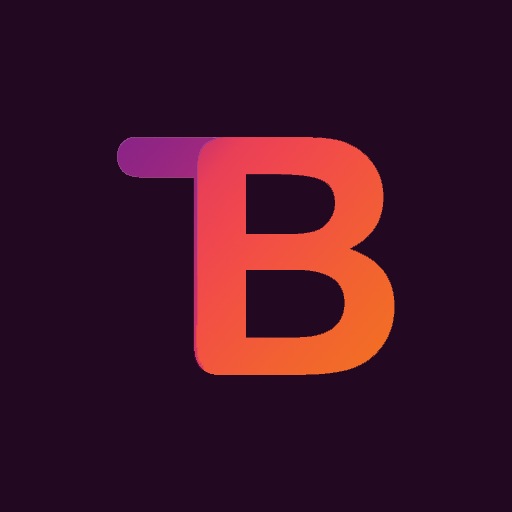

# The-Bot

* It is a discord bot for moderation.

* Use !help to get the commands you can use.

> Inorder to know more about the commands join my discord server.

#### License:

This project is licensed under a MIT license.

#### Reference:
The tutorial on discord bot dev using discord.js by 
[CodeLyon](https://youtube.com/playlist?list=PLbbLC0BLaGjpyzN1rg-gK4dUqbn8eJQq4)

Followed tutorial by [Worn off keys](https://youtu.be/mHKbU8nOW58) to implement a warn system through database (mongodb).

### Join Us:
You can also join my discord server. Its all about helping people in development. Like modelling using blender, unity game dev, programming, unreal, and also some pc stuff you can try. Here is the link for my server and if you like, join it and also share with your friends who are seeking help or learining something.
[The Atelier discord server](https://discord.gg/6Mcy5NpSpH)

### Contribute:
You can contribute to The-Bot by opening an issue for bugs or by opening a pull request to add some features. 

### Support me:
you can support me on [The Atelier team patreon](https://www.patreon.com/the_Atelier)
Thanks for the support.